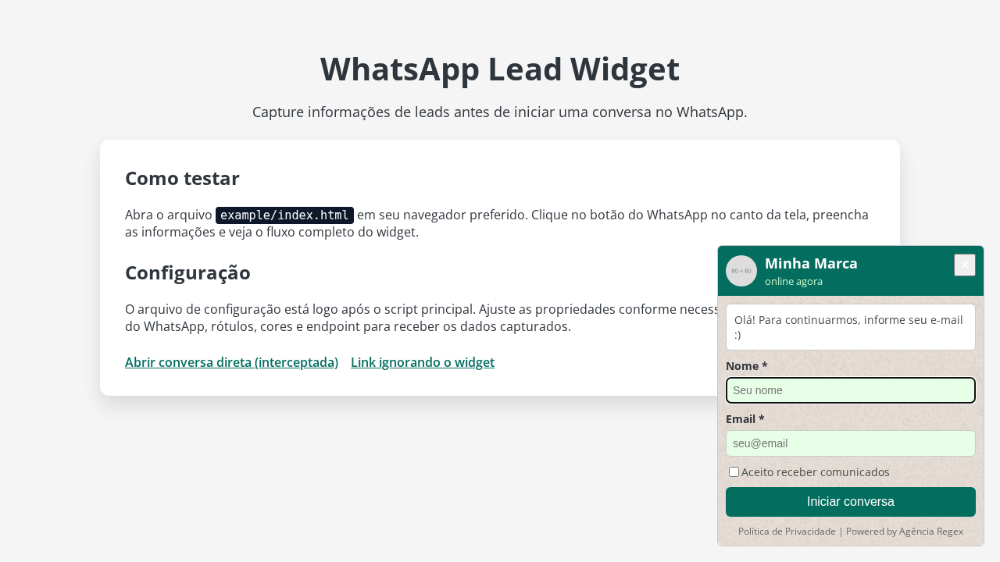

Este repositório contém um modelo de Google Apps Script para integrar uma planilha do Google com aplicações externas via Web App. Copie o conteúdo de `apps-script.gs` para o editor do Apps Script vinculado à sua planilha e ajuste as configurações conforme necessário.
=======
# WhatsApp Lead Widget

Widget pronto para uso que capta informações de leads (nome, e-mail, telefone, consentimento e dados extras) antes de abrir uma conversa no WhatsApp. O componente foi pensado para ser facilmente incorporado em qualquer site estático ou aplicação existente.

## Recursos

- Botão flutuante com modal personalizado.
- Formulário com campos de e-mail e telefone configuráveis.
- Envio opcional dos dados para um endpoint (por exemplo, Google Apps Script).
- Registro de evento no Google Analytics 4 (opcional).
- Interceptação automática de links WhatsApp existentes na página.
- API pública para abrir o widget e alterar o número dinamicamente.

## Como usar

1. Copie o arquivo [`src/whatsapp-lead-widget.js`](src/whatsapp-lead-widget.js) para o seu projeto ou carregue-o via CDN próprio.
2. Inclua o script no final do `body` da sua página.
3. Em seguida, inicialize o widget com a configuração desejada:



```html
<script src="/caminho/para/whatsapp-lead-widget.js"></script>
<script>
  WhatsAppLeadWidget.init({
    scriptURL: "https://script.google.com/macros/s/SEU_SCRIPT/exec",
    whatsappNumber: "5511999999999",
    brandImage: "https://exemplo.com/logo.png",
    brandTitle: "Minha Marca",
    brandStatus: "online",
    privacyPolicyUrl: "https://exemplo.com/politica",
    interceptLinks: true,
    enableGA4: true,
    contactFields: {
      email: { enabled: true, required: true },
      phone: { enabled: false, required: true }
    },
    texts: {
      welcome: "Olá! Para continuarmos, informe seus dados :)",
      nameLabel: "Nome",
      emailLabel: "Email",
      phoneLabel: "Telefone",
      consentLabel: "Aceito receber comunicados",
      submit: "Iniciar conversa",
      required: "Por favor, preencha os campos obrigatórios.",
      emailPlaceholder: "nome@empresa.com",
      phonePlaceholder: "(11) 98888-7777"
    },
    theme: {
      primary: "#036d5f",
      primaryHover: "#02594d",
      bubbleBg: "#efeae2",
      inputBg: "#e7ffe7"
    },
    extraFields: {
      origem: "Website - WhatsApp Widget"
    }
  });
</script>
```

> Observação: o número do WhatsApp deve estar no formato `DDI + DDD + número`, contendo apenas dígitos.

### Configurar a planilha do Google Sheets

1. Acesse o [Google Sheets](https://docs.google.com/spreadsheets/) e crie uma nova planilha em branco.
2. Renomeie a aba principal para algo fácil de identificar, por exemplo `Leads`.
3. Na linha de cabeçalho (células `A1` em diante), preencha os seguintes rótulos, respeitando esta ordem: `nome`, `email`, `telefone`, `consent`, `timestamp`, `data/hora da ação`, `userAgent`, `pageUrl`, `userIP`, `gbraid`, `wbraid`.
4. Caso deseje armazenar outros metadados enviados pelo widget, adicione novas colunas após `wbraid` com os nomes correspondentes.
5. Compartilhe a planilha com o mesmo usuário que será utilizado no Google Apps Script (ou defina permissões conforme necessário) para garantir que o script possa gravar os dados.

### Conectar com o Apps Script

O modelo presente em [`apps-script.gs`](apps-script.gs) usa `JSON.parse(e.postData.contents)` para tratar requisições vindas de clientes que enviam o corpo como JSON. Quando o único cliente for o widget deste repositório, o Apps Script pode ler diretamente os parâmetros enviados pelo formulário, montando o `payload` a partir de `e.parameter`/`e.parameters` (consulte as linhas 102–114 para ajustar o template).

#### Publicar o Web App

Depois de colar o conteúdo do arquivo `apps-script.gs` no editor do Apps Script e associá-lo à sua planilha:

1. Clique em **Implantar → Nova implantação**.
2. No painel que abrir, selecione **App da Web** como tipo de implantação.
3. Preencha a **Descrição** com algo que ajude a identificar o projeto (por exemplo, "Webhook do Widget WhatsApp").
4. Em **Executar como**, escolha a sua conta (o mesmo usuário que tem acesso de edição à planilha).
5. Em **Quem pode acessar**, selecione **Qualquer pessoa com uma Conta do Google** (ou **Qualquer pessoa** se disponível na sua conta). Essa opção garante que o Web App aceite requisições externas do widget.
6. Clique em **Implantar** e autorize o script quando solicitado.
7. Copie a URL exibida como **URL do App da Web** e informe-a na opção `scriptURL` da configuração do widget.

> Durante a primeira execução ou implantação você pode ver o aviso **"Google não verificou este app"**. Esse alerta aparece em
> projetos novos que usam escopos sensíveis (como o acesso à planilha) e é esperado quando o script é utilizado internamente.
> Para prosseguir, clique em **Avançado** → **Ir para _nome-do-projeto_ (não seguro)** e conclua a autorização. Caso precise
> compartilhar o Web App com outras pessoas sem exibir o aviso, defina a tela de consentimento como *Projeto interno* (ou
> adicione os usuários como testadores) e inicie o processo de verificação junto ao Google quando for abrir o acesso ao
> público externo.

#### Exemplo de `doPost` com parâmetros

```js
function doPost(e) {
  const payload = {
    nome: e.parameter.nome,
    email: e.parameter.email,
    telefone: e.parameter.telefone,
    consent: e.parameter.consent === 'true',
    timestamp: new Date(),
    userAgent: e.parameter.userAgent,
    pageUrl: e.parameter.pageUrl,
    userIP: e.parameter.userIP,
  };

  appendToSheet_(payload);

  return ContentService.createTextOutput(
    JSON.stringify({ success: true })
  ).setMimeType(ContentService.MimeType.JSON);
}
```

## Exemplo

Um exemplo completo está disponível em [`example/index.html`](example/index.html). Abra o arquivo direto no navegador para testar a experiência.

## Personalização

- **Texts**: altere rótulos, mensagens e textos exibidos no modal.
- **Campos de contato**: utilize `contactFields` para escolher entre capturar e-mail, telefone ou ambos, além de definir se cada um deve ser obrigatório.

### Configurando obrigatoriedade dos campos

O objeto `contactFields` controla tanto quais campos serão exibidos quanto a obrigatoriedade de cada um. O nome é sempre obrigatório e exibido; já e-mail e telefone podem ser habilitados ou não por meio da flag `enabled`. Quando um campo está desabilitado (`enabled: false`), a configuração `required` é ignorada automaticamente pelo widget.

```js
contactFields: {
  email: { enabled: true, required: true },
  phone: { enabled: true, required: true }
}
```

Com essa estrutura você pode compor os cenários abaixo:

- **Nome e e-mail obrigatórios**: `email.enabled = true`, `email.required = true`, `phone.enabled = false`.
- **Nome e telefone obrigatórios**: `phone.enabled = true`, `phone.required = true`, `email.enabled = false`.
- **Nome, e-mail e telefone**: habilite ambos; ajuste `required` individualmente (`true` para obrigatório, `false` para opcional).

Caso queira deixar, por exemplo, o telefone opcional ao mesmo tempo em que mantém o campo visível, utilize `phone: { enabled: true, required: false }`. O formulário refletirá o status no rótulo (asterisco para obrigatórios) e só permitirá o envio quando os campos marcados como obrigatórios estiverem preenchidos.
- **Theme**: personalize cores de destaque, hover e elementos do formulário.
- **Interceptação de links**: habilite `interceptLinks: true` para que links `wa.me`, `api.whatsapp.com/send` e `whatsapp://send` abram o widget antes da conversa.
- **Campos extras**: adicione pares chave/valor em `extraFields` para enviar metadados ao seu backend.
- **Captação automática de UTMs**: quando presentes na URL, `utm_source`, `utm_medium`, `utm_campaign`, `gclid`, `fbclid`, `gbraid` e `wbraid`, além de `page_url` e `referrer`, são enviados automaticamente no payload do formulário.
- **Pré-preenchimento e persistência**: utilize `prefill` para carregar dados iniciais e `storageKey` com `storageExpirationMinutes`
  para guardar as informações do visitante no `localStorage`.
- **API pública**: após inicializar o widget, é possível utilizar `WhatsAppLeadWidget.open(number?)`, `WhatsAppLeadWidget.setNumber(number)`, `WhatsAppLeadWidget.close()` e `WhatsAppLeadWidget.destroy()`.
- **Acessibilidade aprimorada**: o modal possui foco aprisionado e pode ser fechado com a tecla `Esc`, além de melhor suporte para leitores de tela.

## Desenvolvimento

- O código principal está em `src/whatsapp-lead-widget.js` e não depende de bundlers.
- Para visualizar alterações rapidamente, abra `example/index.html` com Live Server ou semelhante.
- Para publicar em um CDN, basta minificar o arquivo se desejar e disponibilizá-lo.

## Licença

[MIT](LICENSE)
